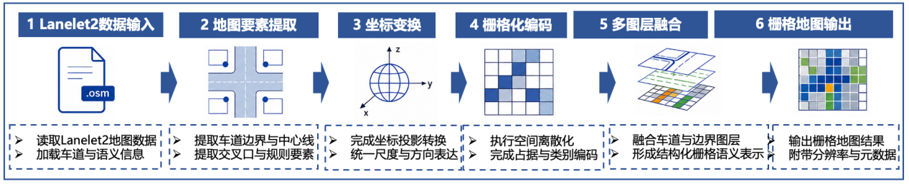
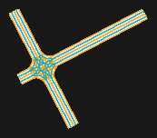

# Lanelet2 To Raster

The raster workflow transforms lane-level vector geometry into a metric,
regular grid while retaining graph information in a sidecar. It is designed
for occupancy reasoning, planning, learning pipelines and fast spatial lookup.



## Processing Model

1. Parse Lanelet2 `node`, `way` and `type=lanelet` relations.
2. Resolve and orient left/right boundaries; derive centerlines by equal-length sampling.
3. Use complete `local_x/local_y` coordinates or project longitude/latitude to local UTM.
4. Reconstruct drivable polygons and infer successor/predecessor plus lateral adjacency.
5. Rasterize at a supersampled resolution and reduce onto the requested output grid.
6. Write semantic, occupancy, preview, metadata and diagnostic products.

## Semantic Schema

| Band | Name | Encoding |
| ---: | --- | --- |
| 1 | `DRIVABLE_AREA` | `1` inside reconstructed lanelet polygons |
| 2 | `LANE_BOUNDARY` | `1` on left/right boundary pixels |
| 3 | `CENTERLINE` | `1` on explicit or reconstructed centerlines |
| 4 | `DIRECTION_BITS` | eight compass sectors encoded as a bit set |
| 5 | `TOPOLOGY_ANCHOR` | lanelet start/end anchors |
| 6 | `LANELET_INDEX` | run-local index linked to source IDs in metadata |

The companion occupancy raster uses `0=free` and `1=occupied`. Pixel layers
cannot faithfully contain all overlapping identities or graph edges, so the
metadata JSON is part of the output contract rather than an optional log.

## Configuration

```yaml
raster:
  resolution_m: 0.5
  padding_m: 5.0
  supersampling: 4
  topology_tolerance_m: 1.0
  max_output_pixels: 40000000
```

The pixel guard prevents accidental allocation of an unbounded monolithic
raster. Increase resolution or tile a very large source instead of disabling
the guard without a memory budget.

## Verified Example



Run `python examples/lanelet2_to_raster.py`. Results are written below
`data/results/lanelet2_to_raster/<map>/run_###/` without modifying the source.
